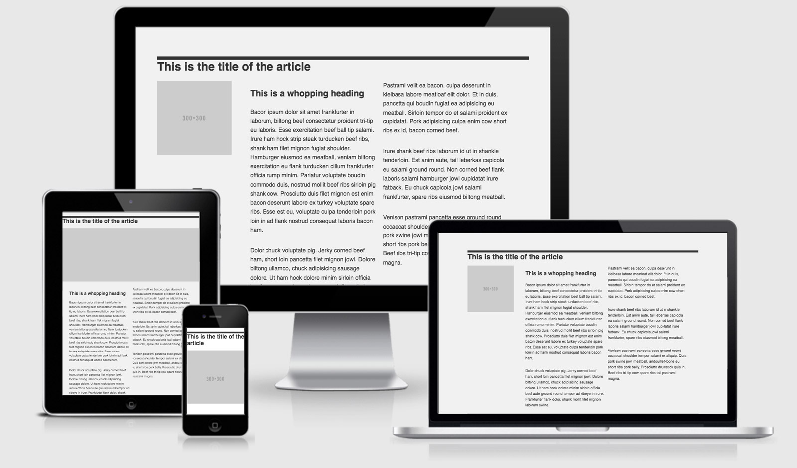

# rwd-patterns
This is the third project from Juan Pablo's course of [Web Development](https://www.udemy.com/course/desarrollo-web-completo-con-html5-css3-js-php-y-mysql/).

This project contents a bunch of design patterns such as **layout shifter**, **mostly fluid**, **tiny tweaks**, **column drop**, etc.

> **Note:** most of the patterns located here have a Flexbox and a Grid version, that way you can comparate which one requires less code :D. From my perspective each and every pattern could work better if you use Grid instead of Flexbox (in most of the cases requires less code, or if it's the same as in Flexbox...is easier to understand and write with Grid).

## RWD Patterns

